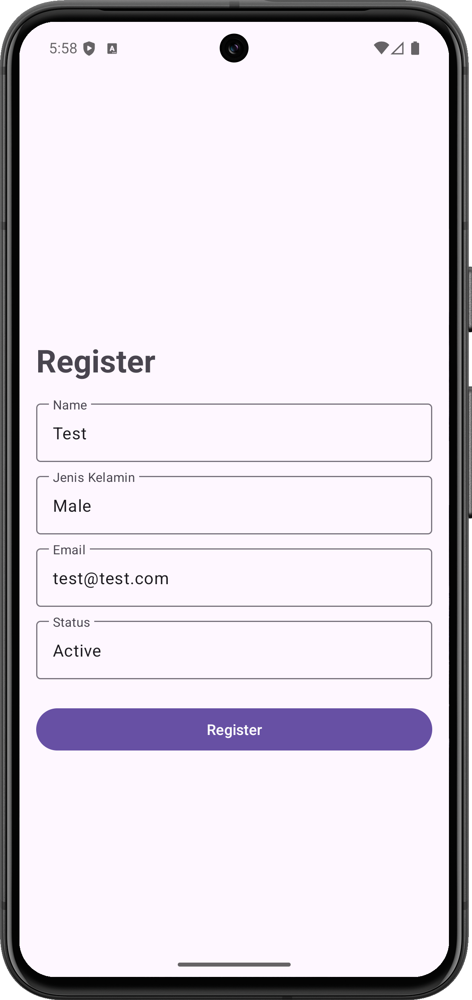
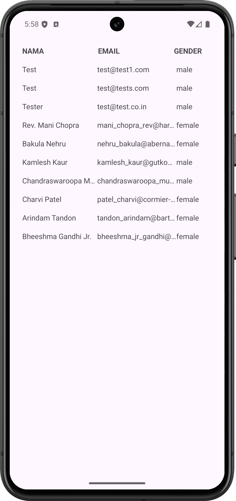

# APICalling

An Android application built with Kotlin that demonstrates RESTful API integration, user registration, and data management using modern Android development practices.

<p align="center">
  
  
</p>

## Features

- **User Registration**: Register new users with form validation
  - Name validation
  - Gender validation (male/female)
  - Email validation (pattern matching)
  - Status validation (active/inactive)
- **User List**: Display all registered users in a table format
- **API Integration**: Real-time communication with GoRest API
- **Clean Architecture**: Separation of concerns with MVVM pattern
- **Dependency Injection**: Hilt for dependency management
- **Coroutines**: Asynchronous operations with Kotlin Coroutines

## Tech Stack

- **Language**: Kotlin
- **Architecture**: MVVM + Clean Architecture
- **UI**: View Binding (XML layouts)
- **Networking**: Ktorfit + Ktor Client
- **Serialization**: Kotlinx Serialization
- **DI**: Hilt (Dagger)
- **Async**: Kotlin Coroutines + Flow
- **Logging**: Timber
- **Navigation**: Android Navigation Component
- **Min SDK**: 24 (Android 7.0)
- **Target SDK**: 36
- **Compile SDK**: 36

## Project Structure

```
app/src/main/java/id/my/mufidz/apicalling/
├── APICalling.kt                  # Application class with Hilt
├── base/                          # Base classes for architecture
│   ├── BaseActivity.kt
│   ├── BaseViewModel.kt
│   ├── BaseUseCase.kt
│   └── BaseAdapter.kt
├── data/                          # Data layer
│   ├── ApiServices.kt            # API endpoints
│   ├── UserRepository.kt         # Repository pattern
│   ├── DataResult.kt             # Result wrapper
│   └── ErrorResponse.kt          # Error handling
├── di/                           # Dependency Injection modules
│   ├── NetworkModule.kt
│   ├── RepositoryModule.kt
│   ├── UseCaseModule.kt
│   └── DispatcherModule.kt
├── model/                        # Data models
│   └── User.kt
├── screen/                       # UI screens
│   ├── register/                 # Registration screen
│   │   ├── MainActivity.kt
│   │   ├── RegisterViewModel.kt
│   │   ├── RegisterUseCase.kt
│   │   └── RegisterContract.kt
│   └── home/                     # Home screen (user list)
│       ├── HomeScreen.kt
│       ├── HomeViewModel.kt
│       ├── HomeUseCase.kt
│       ├── HomeContract.kt
│       └── UserTableAdapter.kt
└── utils/                        # Utility classes
    ├── ViewBindingDelegate.kt
    └── ResponseAdapterFactory.kt
```

## API Integration

The app integrates with [GoRest API](https://gorest.co.in/) for:
- `POST /users` - Register new user
- `GET /users` - Fetch all users

### API Configuration

1. Create a `secrets.properties` file in the root directory:
```properties
APIKEY=your_gorest_api_key_here
```
or you can copy example file and fill it with your API key
```
cp secrets.properties.example secrets.properties
```

2. The API key is loaded via BuildConfig at runtime

## Dependencies

- **Networking**: Ktorfit, Ktor Client, Kotlinx Serialization
- **DI**: Hilt Android
- **UI**: Material Components, ConstraintLayout
- **Async**: Coroutines, Flow
- **Logging**: Timber
- **KSP**: Kotlin Symbol Processing for code generation

## Building the Project

### Prerequisites

- Android Studio (latest version recommended)
- JDK 11 or higher
- Android SDK with API level 36
- GoRest API key from [gorest.co.in](https://gorest.co.in/)

### Build Instructions

1. Clone the repository
2. Create `secrets.properties` file with your API key
3. Open the project in Android Studio
4. Sync Gradle dependencies
5. Run the app on an emulator or physical device

```bash
./gradlew build
```

## How to Use

1. Launch the app to see the registration form
2. Fill in all required fields:
   - Name (required)
   - Gender (male/female)
   - Email (valid email format)
   - Status (active/inactive)
3. Click "Register" to create a new user
4. After successful registration, navigate to the home screen
5. View all registered users in the table
