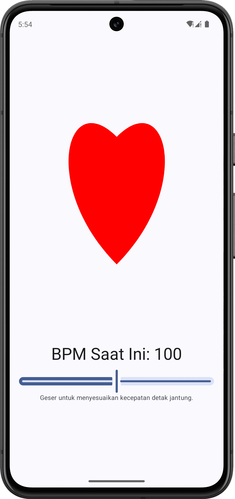

# HeartAnim

An interactive Android application built with Kotlin and Jetpack Compose that displays an animated heartbeat visualization with adjustable BPM (Beats Per Minute).

<p align="center">
  
</p>

## Features

- **Animated Heart**: Real-time heart beating animation using Canvas API
- **BPM Control**: Adjustable heart rate from 0 to 200 BPM using a slider
- **Dynamic Animation**: Animation speed and scale automatically adjust based on BPM
  - Higher BPM = Faster, smaller pulses
  - Lower BPM = Slower, larger pulses
- **Material Design 3**: Modern UI with Material Design 3 components
- **Smooth Animations**: Infinite repeatable animations with reverse effect

## Tech Stack

- **Language**: Kotlin
- **UI Framework**: Jetpack Compose
- **Architecture**: Single Activity with Composable functions
- **Animation**: Compose Animation API with infinite transitions
- **Graphics**: Canvas API for custom heart shape drawing
- **Min SDK**: 24 (Android 7.0)
- **Target SDK**: 36
- **Compile SDK**: 36

## Dependencies

- AndroidX Core KTX
- Lifecycle Runtime KTX
- Activity Compose
- Compose BOM
- Material Design 3
- Compose Animation Core

## Project Structure

```
app/src/main/java/id/my/mufidz/heartanim/
├── MainActivity.kt         # Main activity with HeartBeatScreen composable
├── HeartBeatAnim.kt       # Heart animation composable with Canvas drawing
├── BpmState.kt            # Data class for BPM state management
└── ui/theme/              # Theme configuration
    ├── Color.kt
    ├── Theme.kt
    └── Type.kt
```

## How It Works

1. The app displays a red heart shape drawn using Bézier curves on a Canvas
2. Use the slider to adjust the BPM (0-200)
3. The heart animates with a pulsing effect that matches the selected BPM
4. Animation scale is inversely proportional to BPM for realistic heart behavior
5. At 0 BPM, the animation stops

### Animation Logic

- **Duration Calculation**: `60000ms / BPM` determines the beat interval
- **Scale Range**: 1.05x to 1.25x based on BPM value
- **Animation Mode**: Infinite reverse for continuous beating effect

## Building the Project

### Prerequisites

- Android Studio (latest version recommended)
- JDK 11 or higher
- Android SDK with API level 36

### Build Instructions

1. Clone the repository
2. Open the project in Android Studio
3. Sync Gradle dependencies
4. Run the app on an emulator or physical device

```bash
./gradlew build
```
