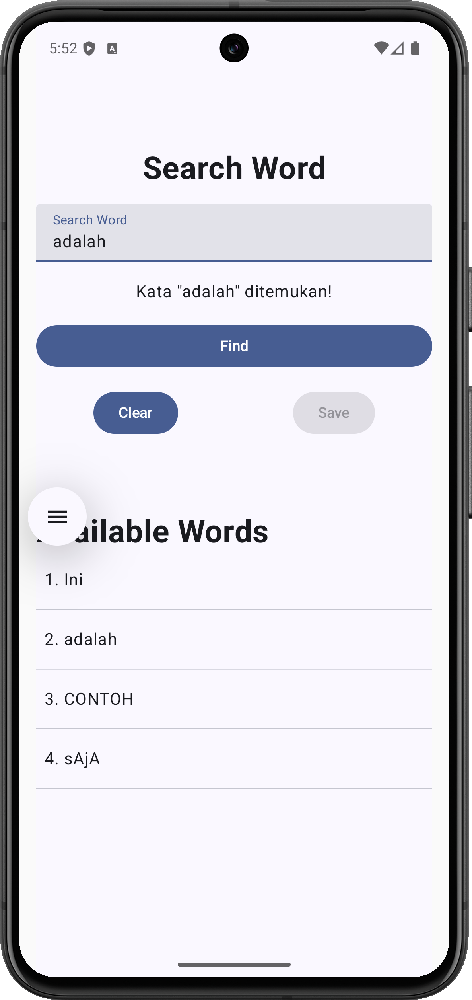
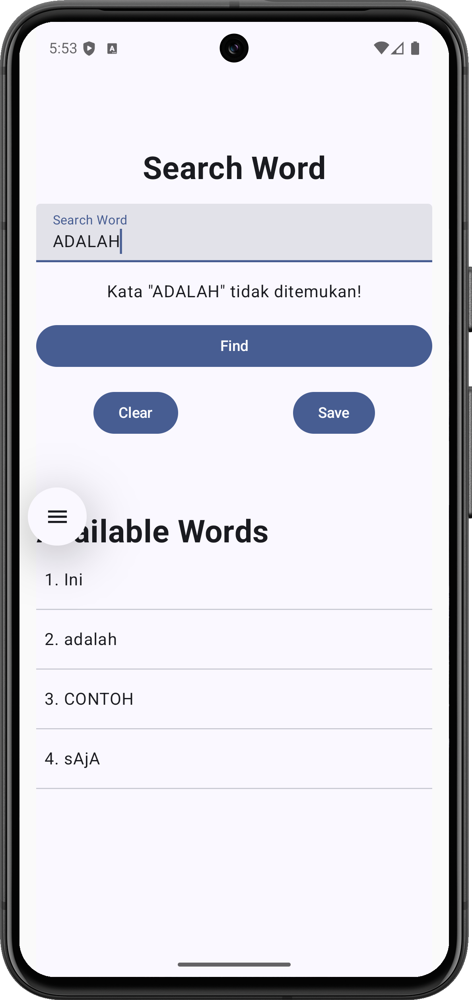

# SearchWord

A simple Android application built with Kotlin and Jetpack Compose that allows users to search for words in a list and add new words if they don't exist.

<p align="center">
  
  
</p>

## Features

- **Word Search**: Search for words in the available words list with **case-sensitive** matching
- **Add New Words**: Save new words to the list if they're not found
- **Real-time Feedback**: Instant visual feedback when searching for words
- **Material Design 3**: Modern UI built with Material Design 3 components
- **Animated UI**: Smooth animations for enhanced user experience

## Tech Stack

- **Language**: Kotlin
- **UI Framework**: Jetpack Compose
- **Architecture**: Single Activity with Composable functions
- **Min SDK**: 24 (Android 7.0)
- **Target SDK**: 36
- **Compile SDK**: 36

## Dependencies

- AndroidX Core KTX
- Lifecycle Runtime KTX
- Activity Compose
- Compose BOM
- Material Design 3

## Project Structure

```
app/src/main/java/id/my/mufidz/searchword/
├── MainActivity.kt          # Main activity and composable screens
└── ui/theme/               # Theme configuration
    ├── Color.kt
    ├── Theme.kt
    └── Type.kt
```

## How It Works

1. Enter a word in the search field
2. Click "Find" to search for the word in the available words list
3. The app will display whether the word was found or not
4. If the word is not found, you can save it to the list using the "Save" button
5. Use "Clear" to reset the search field

## Building the Project

### Prerequisites

- Android Studio (latest version recommended)
- JDK 11 or higher
- Android SDK with API level 36

### Build Instructions

1. Clone the repository
2. Open the project in Android Studio
3. Sync Gradle dependencies
4. Run the app on an emulator or physical device

```bash
./gradlew build
```