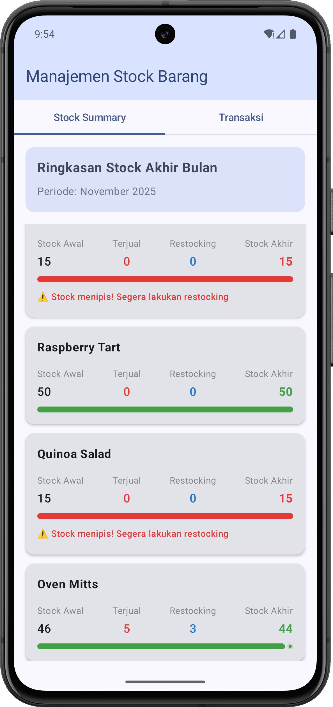
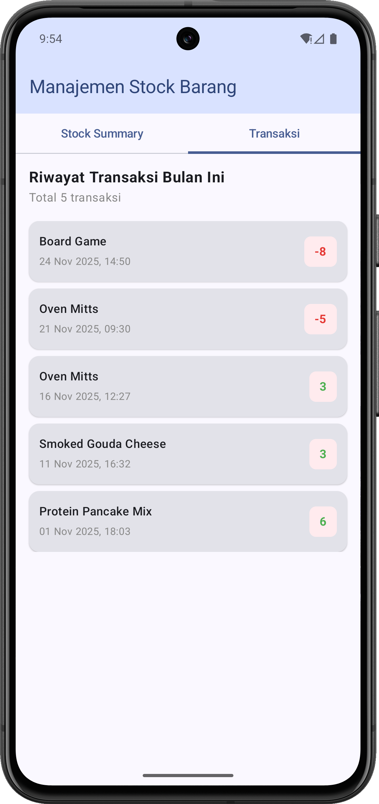

# StockApp - Inventory Management System

A modern Android inventory management application built with Kotlin and Jetpack Compose. This app helps track product stock levels, sales, and purchase transactions with an intuitive interface.

<p align="center">
  
  
</p>

## Features

### Stock Summary
- **End-of-Month Stock Summary**: View consolidated stock information for all products
- **Real-time Calculations**: Automatically calculates remaining stock based on sales and purchases
- **Detailed Metrics**: Shows initial stock, total sales, total purchases, and remaining stock
- **Period Tracking**: Displays current month and year for stock reporting

### Transaction Management
- **Transaction History**: View all sales and purchase transactions
- **Transaction Types**: 
  - **SALE**: Track product sales and stock reduction
  - **PURCHASE**: Track product purchases and stock addition
- **Detailed Information**: Each transaction shows product name, quantity, date, and type
- **Chronological Sorting**: Transactions sorted by date (newest first)

### Product Catalog
- Pre-loaded product database from JSON
- Product information includes:
  - ID and name
  - Category
  - Initial stock quantity
  - Price

## Architecture & Tech Stack

### Modern Android Development
- **Language**: Kotlin
- **UI Framework**: Jetpack Compose
- **Design System**: Material Design 3
- **Minimum SDK**: API 24 (Android 7.0)
- **Target SDK**: API 36

## 📂 Project Structure

```
StockApp/
├── app/
│   ├── src/
│   │   └── main/
│   │       ├── assets/
│   │       │   └── products.json         # Product database
│   │       ├── java/id/my/mufidz/stockapp/
│   │       │   ├── model/
│   │       │   │   ├── Product.kt        # Product data model
│   │       │   │   ├── Transaction.kt    # Transaction & type enum
│   │       │   │   └── StockSummary.kt   # Stock summary model
│   │       │   ├── ui/theme/
│   │       │   │   ├── Color.kt
│   │       │   │   ├── Theme.kt
│   │       │   │   └── Type.kt
│   │       │   ├── MainActivity.kt       # Main entry point
│   │       │   ├── StockSummaryScreen.kt # Stock overview screen
│   │       │   ├── StockSummaryCard.kt   # Stock card component
│   │       │   ├── TransactionListScreen.kt  # Transaction list screen
│   │       │   ├── TransactionCard.kt    # Transaction card component
│   │       │   └── Utils.kt              # Helper functions
│   │       ├── res/                      # Resources
│   │       └── AndroidManifest.xml
│   └── build.gradle.kts
└── build.gradle.kts
```

## Getting Started

### Prerequisites
- **Android Studio**: Hedgehog (2023.1.1) or later
- **JDK**: Version 11 or higher
- **Android SDK**: API 24 or higher
- **Gradle**: 8.0+

### Installation

1. **Clone the repository**
   ```bash
   git clone <repository-url>
   cd StockApp
   ```

2. **Open in Android Studio**
   - Launch Android Studio
   - Select "Open an Existing Project"
   - Navigate to the StockApp directory

3. **Sync Gradle**
   - Android Studio will automatically sync Gradle
   - Wait for dependencies to download

4. **Run the app**
   ```bash
   # Using Gradle command line
   ./gradlew installDebug
   
   # Or use the Run button in Android Studio
   ```

## 💡 How It Works

### Transaction Generation
For demo purposes, the app generates random transactions:
- Random dates within the current month
- Random products from the catalog
- Random quantities (1-10 or limited by available stock)
- Random transaction types (SALE or PURCHASE)

### Data Loading
Product data is loaded from `assets/products.json` at app startup:
- JSON file contains 10 sample products
- Categories include Automotive, Home, Kitchen, Toys, and Food
- Stock levels and prices pre-configured

## Key Features Implementation

### Tab Navigation
Two main tabs for different views:
1. **Stock Summary**: Overview of all products with calculated stock levels
2. **Transaksi**: List of all transactions with details

### Material Design 3
- Modern UI with Material 3 components
- Theme-aware colors and styling
- Responsive layouts with Compose

## 🔧 Configuration

### Modifying Product Data
Edit `app/src/main/assets/products.json`:
```json
[
  {
    "id": 1,
    "name": "Product Name",
    "initialStock": 50,
    "category": "Category",
    "price": 29.99
  }
]
```
You can generate too with [mockaroo.com.](https://mockaroo.com/)

### Adjusting
Modify the transaction generation logic in `MainActivity.kt`:
- Change `repeat(5)` to generate more/fewer transactions
- Adjust date ranges
- Modify quantity ranges
